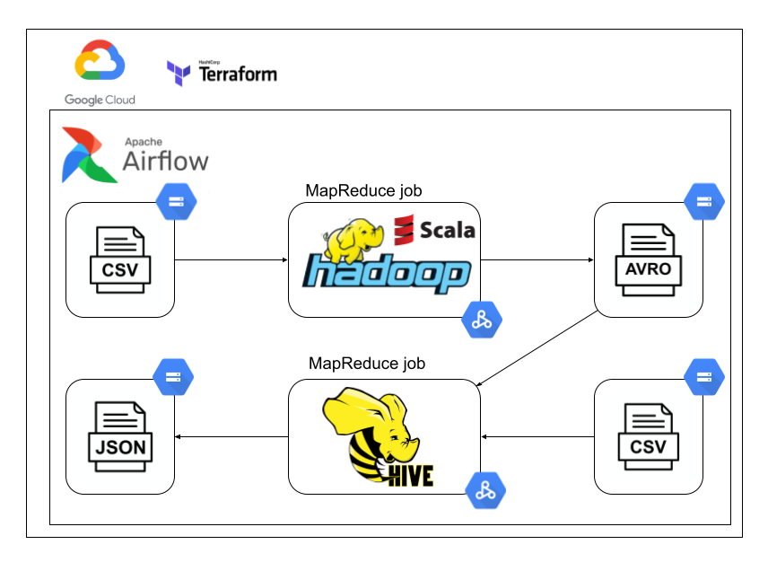

# About the project

It is an academic project created to complete course "Processing big data".

The main goal of this project was to implement MapReduce processing with Apache Hadoop and Apache Hive.

Additionally, I implemented jobs scheduling using Apache Airflow and infrastructure configuration with Terraform.

## Data sets

Source: https://opendata.cityofnewyork.us/data/

1. NYPD_Motor_Vehicle_Collisions.csv - road accident data.
2. zips-boroughs.csv – postcode zone data.

First job (Hadoop MapReduce) loads data from `NYPD_Motor_Vehicle_Collisions` and counts the number of injured people for each street,
distinguishing by the type of injured person (pedestrian, cyclist, motorist) and the type of injury (injured, killed).
The results have to be limited to accidents after 2012 and described with a zip code.

The result should have the following attributes:
* street
* zip code
* type of injured person
* type of injury
* number of injured people

The result file must be in a binary format - I chose the Avro format.

The second job (Hive) loads the output of the first job and the dataset `zips-boroughs.csv` and searches for three streets
in the Manhattan area with the maximum sum of injured and killed people for each type of injured person.

The output file must be in JSON format.
